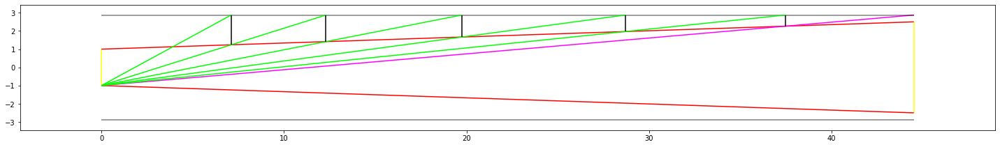

# Baffle calculator
Calculate baffle placement for any refractor OTA.
Here is the graphical result:

And the calculated position/inner radius of the baffles:
- Baffle position, radius (37.473684210526315, 2.263157894736842)
- Baffle position, radius (28.69521410579345, 1.9672544080604535)
- Baffle position, radius (19.73708716838116, 1.6652950730914997)
- Baffle position, radius (12.298381077285741, 1.414552171144463)
- Baffle position, radius (7.107970809288662, 1.2395945216614155)
